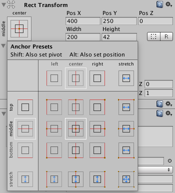
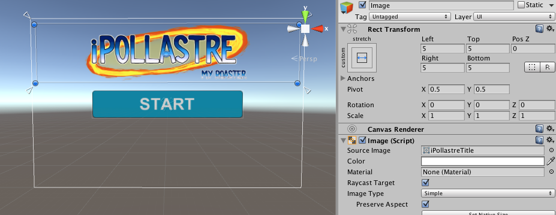

## Interfaz de usuario

El sistema con el que cuenta Unity para crear la interfaz de usuario se introdujo a partir de la versión 4.6. Se trata de un sistema bastante versátil, que utilizado de forma adecuada nos permite crear interfaces como por ejemplo los menús o el HUD del juego que se adapten a diferentes tamaños y formas de pantalla.

Todo el contenido de la interfaz de usuario estará contenido en nuestra escena dentro de un elemento tipo `Canvas` \(es decir, un _game object_ que cuente con un componente `Canvas`\). Dentro de él ubicaremos todos los componentes de la interfaz, como por ejemplo imágenes, etiquetas de texto o botones.

### Canvas

El `Canvas` será el panel 2D \(_lienzo_\) donde podremos crear el contenido de la interfaz de usuario. Los componentes de la interfaz siempre deberán estar dentro de un `Canvas` en la jerarquía de la de escena. Si intentamos arrastrar sobre la escena un componente de la UI sin un `Canvas`, el `Canvas` se creará de forma automática.

Una propiedad importante del componente `Canvas` es _Render Mode_, que podrá tomar 3 valores:

* **Screen Space - Overlay**: El `Canvas` se dibuja sobre el contenido que aparece en pantalla, ajustándose siempre al tamaño de la misma.
* **Screen Space - Camera**: Similar a la anterior, pero en este caso debemos vincularlo a una cámara, indicando la distancia a la que estará el `Canvas` de la cámara seleccionada, y el `Canvas` se ajustará al tamaño que tenga el tronco de la cámara a dicha distancia. Se aplicarán sobre el `Canvas` los parámetros de la cámara seleccionada.
* **World Space**: En este caso el `Canvas` se comportará como cualquier otro objeto 3D en la escena. Le daremos un tamaño fijo al panel y lo situaremos en una posición del mundo. Así podremos tener interfaces con las que podamos interactuar en nuestro mundo 3D.

> En la previsualización de la escena, cuando tengamos un `Canvas` de tipo _Screen Space_ es posible que lo veamos de un tamaño mucho mayor que el resto de elementos de la escena. Esto se debe a que las unidades con las que trabaja internamente el `Canvas` son _pixels_ en pantalla, mientras que es habitual que los elementos de la escena tengan dimensiones de alrededor de una unidad. Al ejecutar el juego no habrá ningún problema ya que el `Canvas` se ajustará al tamaño de la pantalla o de la cámara.

### Elementos de la UI

Una vez contamos con un `Canvas`, podemos añadir dentro de él diferentes componentes de la interfaz. Encontramos diferentes tipos de componentes como etiquetas de texto, imágenes o botones que podremos incluir de forma sencilla.

#### Etiquetas de texto

Las etiquetas de texto serán objetos con un componente de tipo `Text`. Este componente nos permite indicar principalmente el texto a mostrar en la etiqueta, y también podemos especificar otras propiedades como la fuente, color, alineación o espaciado.

Es de especial interés la propiedad _Best Fit_. Con ella podemos especificar un tamaño máximo y mínimo de la fuente, de forma que se ajuste de forma automática entre estos valores al tamaño máximo que podamos tener sin que el texto se salga de su espacio. Es interesante cuando el texto puede ser variable \(por ejemplo diferentes idiomas\) y hay riesgo de que en algún caso quede demasiado largo y pudiera mostrarse truncado.

#### Imágenes

Las imágenes son objetos con un componente `Image`. En este componente deberemos introducir principalmente la textura o sprite a mostrar como imagen, que deberemos haber introducido previamente entre los _assets_ del proyecto.

Utilizaremos preferiblemente imágenes de tipo PNG, y las podremos incluir como _assets_ simplemente arrastrándolas sobre la sección _Project_ del editor \(podemos organizarlas en carpetas\).

#### Botones

Un botón es un objeto con un componente `Button`, que además contendrá como hijo un objeto de tipo _Text_ para mostrar la etiqueta del botón \(se trata por separado el botón de su etiqueta\). El botón tendrá una imagen que podremos mostrar como marco, y distintos colores con los que _tintar_ el botón según el estado en el que se encuentre:

* _Normal_: Botón activo pero sin pulsar ni seleccionar.
* _Highlighted_: Botón activo y seleccionado para que se pueda pulsar. Este estado será útil cuando utilicemos un control mediante _joystick_ o teclado: al pulsar los controles direccionales cambiaremos el botón seleccionado, y al pulsar la tecla de acción presionaremos el botón seleccionado actualmente.
* _Pressed_: Botón actualmente presionado. 
* _Disabled_: Indica que el botón está deshabilitado y que no puede ser presionado.

Además en la parte inferior podremos conectar el evento _On Click_ del botón con algún método de nuestro código, para que al pulsar sobre el botón se ejecute dicho método.

### Posicionamiento en el espacio de la UI

Todos los elementos de la UI de Unity se posicionan mediante un componente de tipo `RectTransform` \(a diferencia del resto de objetos que tienen un componente `Tranform`\).

La principal diferencia de `RectTransform` sobre `Tranform` es que nos permite indicar el área rectangular que ocupará el componente dentro del `Canvas`, además de las propiedades de posición, rotación y escala que tenemos en todos los objetos.

A la hora de definir el rectángulo que un componente de la UI ocupará en pantalla, lo primero que deberemos hacer es definir a qué posición de pantalla lo vamos a _anclar_ \(es decir, qué posición de la pantalla tomaremos como referencia para posicionarlo\). Si es un menú que queramos que aparezca centrado, lo deberemos anclar al centro de la pantalla, mientras que si es un marcador que queramos que aparezca en una esquina de la pantalla, lo conveniente será anclarlo a dicha esquina. Unity nos proporciona algunos valores predefinidos típicos para el anclaje \(_Anchor Presets_\):

La posición del objeto será relativa siempre al punto de anclaje. Además, con la propiedad _Pivot_ indicaremos el punto del objeto \(rectángulo\) que haremos coincidir con la posición especificada. El _Pivot_ se indicará siempre en coordenadas normalizadas, entre _\(0,0\)_ y _\(1,1\)_. Con _\(0,0\)_ indicamos la esquina inferior izquierda, con _\(1,1\)_ la esquina superior derecha, y con _\(0.5,0.5\)_ el centro del rectángulo.

Por ejemplo, si queremos situar un botón centrado en pantalla, utilizaremos como punto de anclaje el centro de la pantalla, como posición _\(0,0,0\)_ para situarlo exactamente en el punto de anclaje, y como _pivot_ _\(0.5,0.5\)_ para que el botón aparezca centrado en dicho punto. A continuación vemos un ejemplo:

En caso de querer ubicar un marcador en la esquina superior derecha de la pantalla, en primer lugar deberemos establecer el anclaje en dicha esquina. Para que quede lo mejor ajustado posible es recomendable que el _pivot_ en este caso sea _\(1,1\)_, para que así lo que posicionemos sea la esquina superior derecha. De esta forma, si como posición indicamos _\(0,0,0\)_ el objeto quedará perfectamente ajustado a la esquina. Podríamos modificar la posición si queremos darle un margen respecto a la esquina, pero de esta forma siempre quedará bien ajustado a la esquina y no se nos saldrá de pantalla. A continuación vemos un ejemplo:

Un caso algo más complejo es aquel en el que queremos que un elemento pueda _estirarse_. En este caso, en lugar de tener un ancla única, podemos establecer un ancla para cada esquina del objeto. Podemos ver sobre la imagen una serie de _flechas blancas_ alrededor del título que definen los puntos de anclaje. Podemos arrastrar dichas flechas pulsando sobre ellas con el ratón para así modificar el anclaje:

Vemos que al tener este anclaje _abierto_ en lugar de dar una posición _\(x,y,z\)_ al objeto lo que debemos introducir son valores _Left_, _Right_, _Top_ y _Bottom_. Aquí introduciremos la distancia que debe haber entre los límites del objeto y la zona de anclaje. La zona de anclaje será siempre relativa al tamaño del `Canvas` \(se estirará y se contraerá según la pantalla o ventana donde se ejecute el juego\). De esta forma conseguimos que el rectángulo de nuestro componente se estire o se contraiga también según el espacio disponible, pudiendo hacer así por ejemplo que el título ocupe todo el espacio disponible.

### Escalado del Canvas

Normalmente en nuestro `Canvas` encontraremos un componente adicional que es el `CanvasScaler`. Se trata de un elemento importante a la hora de conseguir interfaces adaptables, ya que nos permite personalizar la forma en la que se escala el contenido del `Canvas` a distintos tamaños de pantalla.

Podemos optar por tres modos:

* **Constant Pixel Size**: Los tamaños de los objetos de la interfaz se especifican en píxels. Si la pantalla tiene más densidad los objetos se verán más pequeños \(a no ser que los hagamos _estirables_ como hemos visto en el apartado anterior\). 
* **Constant Physical Size**: En este caso, a diferencia del anterior, los objetos siempre ocuparán el mismo espacio físico, independientemente de la densidad de pantalla. El posicionamiento y tamaño de los objetos se especifican en píxeles, pero para una determinada densidad de referencia \(indicada en _dpi_ dentro del componente `CanvasScaler`\). Si la pantalla destino tiene una densidad diferente, todos los valores se actualizarán para que todo acabe teniendo las mismas dimensiones físicas \(en _cm_ reales\).
* **Scale With Screen Size**: Este último modo nos permite hacer que todo el contenido de la UI se escale según el tamaño de la pantalla destino. Diseñaremos la interfaz para un tamaño de pantalla \(en pixeles\) de referencia, indicado mediante una propiedad del componente `CanvasScaler`. Si la pantalla tiene diferente ancho o alto, todos los valores se escalarán de forma proporcional. Podemos indicar si queremos que se escale sólo según el ancho, sólo según el alto, o según una mezcla de ambos. 

El modo _Constant Pixel Size_ será poco adecuado cuando estemos destinando el juego a pantallas que puedan tener diferente densidad, pero en caso de que no sea así nos permitirá ajustar mejor los contenidos de la interfaz \(por ejemplo en caso de PC o videoconsolas\).

En caso de destinar nuestro juego a dispositivos móviles, lo recomendable será utilizar _Constant Physical Size_ o _Scale With Screen Size_. La primera nos puede venir bien por ejemplo para menús, donde nos interese que siempre los botones tengan siempre el mismo tamaño \(suficiente para poder pulsar con el dedo sobre él, pero que no ocupe toda la pantalla en un dispositivos grande\). Por otro lado, para elementos del HUD con los que no tenemos que interactuar nos puede venir bien la segunda opción, para así hacer que se escale según la pantalla y no ocupen demasiado espacio en dispositivos pequeños.

## 

