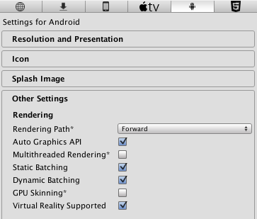
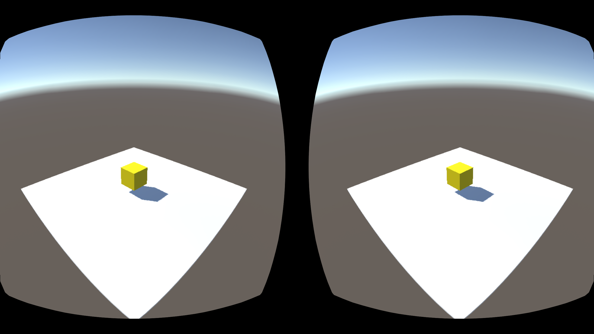
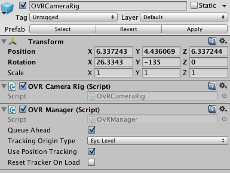
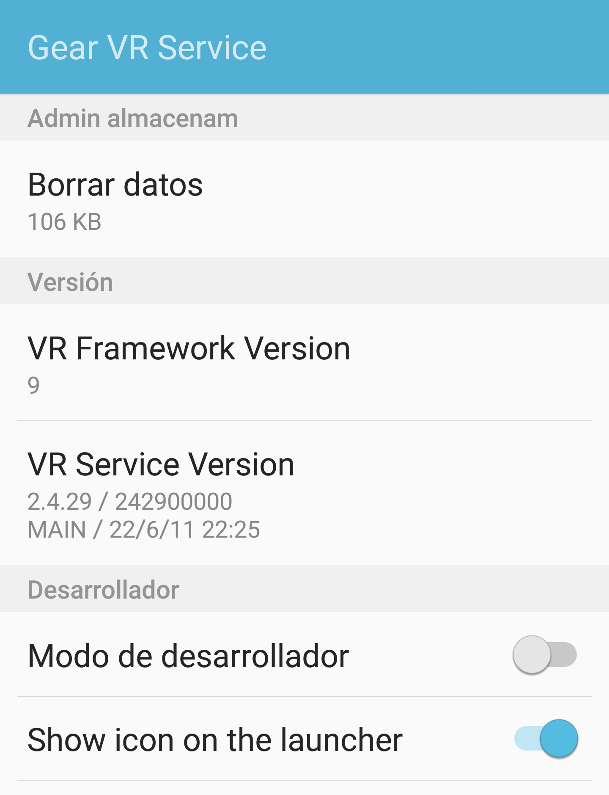
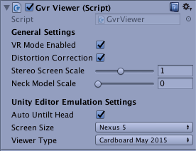
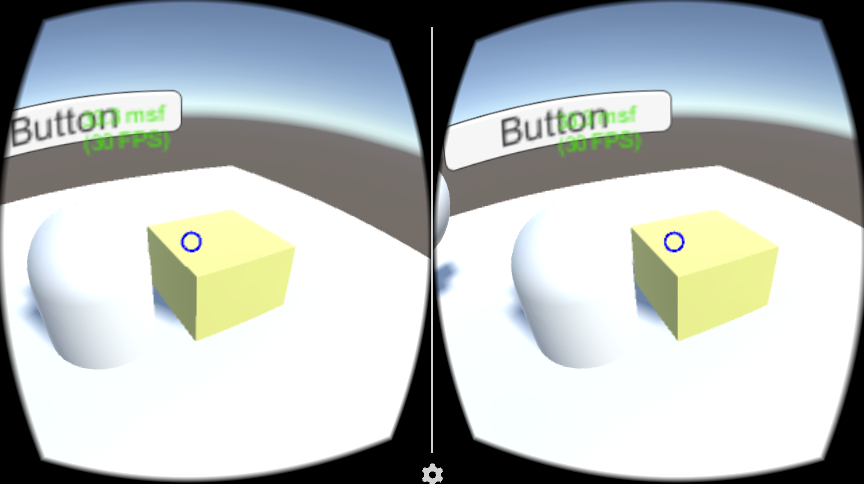

## Realidad Virtual

Existen diferentes dispositivos de realidad virtual, que nos proporcionan una inmersión casi total en la escena, reflejando en la cámara los movimientos de nuestra cabeza, y proporcionando una visión estereoscópica de la escena. Entre los dispositivos más famosos se encuentran Oculus Rift, Samsung Gear VR y Google Cardboard. Aunque todos estos dispositivos proporcionan su propio SDK que podemos integrar en las plataformas nativas de desarrollo, es de especial interés su integración en el entorno Unity, que nos permitirá realizar aplicaciones que los soporten de forma casi inmediata. A continuación veremos cómo utilizarlos con este entorno.

### Oculus Rift / Samsung Gear VR

A partir de Unity 5.1 encontramos en este entorno soporte nativo para los dispositivos Oculus Rift y Samsung Gear VR. Ambos utilizan el mismo SDK y herramientas, con la diferencia de que Oculus Rift funciona sobre plataformas de sobremesa, mientras que Samsung Gear VR funciona sobre móviles Samsung.

Para activar el soporte para estos dispositivos en Unity simplemente tendremos que entrar en _Player Settings_ \(_Edit &gt; Project Settings &gt; Player_\) y bien dentro de la plataforma _Standalone_ \(para Oculus Rift\) o _Android_ \(para Samsung Gear VR\) marcar la casilla _Virtual Reality Supported_, dentro de la sección _Other Settings &gt; Rendering_.



Una vez hecho esto, automáticamente la cámara de la escena se comportará como una cámara VR, girando cuando giremos la cabeza y renderizando una imagen para cada ojo, para así proporcionar visión estéreo.

#### Despliegue de la aplicación en un dispositivo de prueba

Antes de desplegar la aplicación en un dispositivo de prueba, deberemos añadir una firma que nos deberá proporcionar Oculus para nuestro dispositivo concreto. Dicha firma sólo se necesitará durante el desarrollo, cuando la aplicación se publique ya no hará falta.

Para conseguir la firma en primer lugar necesitamos obtener el ID de nuestro dispositivo. Para ello lo conectaremos al sistema y ejecutaremos el comando:

```bash
adb devices
```

En la lista de dispositivos en la primera columna veremos los IDs que buscamos, con el siguiente formato:

```
* daemon started successfully *
1235ba5e7a311272    device
```

En este caso, el ID que buscamos sería `1235ba5e7a311272`. Una vez localizado dicho ID, iremos a la siguiente página para solicitar la firma e introduciremos el ID \(necesitaremos registrarnos previamente como usuarios de Oculus Developer, si no tenemos cuenta todavía\):

[https://developer.oculus.com/osig/](https://developer.oculus.com/osig/)

Una vez introducido el ID nos descargará un fichero `.osig` que deberá ser introducido en nuestro proyecto de Unity en el siguiente directorio:

```
Assets/Plugins/Android/assets
```

Esto lo que hará será colocar dicho fichero en el directorio `assets` del proyecto Unity resultante. Una vez hecho esto ya podremos probar la aplicación en un dispositivo Samsung con Gear VR seleccionando la plataforma _Android_ y pulsando sobre _Build & Run_.

Al desplegar la aplicación en el móvil Samsung, veremos que al ejecutarla nos pide conectar el dispositivo Gear VR al móvil. Una vez conectado, se ejecutará la aplicación y podremos ver nuestra escena de Unity de forma inmersiva.


Sin embargo, veremos que la imagen aparece algo distorsionada al verla a través de las lentes del Gear VR. Esto se debe a que aunque la cámara renderiza en estéreo y responde al movimiento de la cabeza, no se realiza la corrección adecuada a la imagen para verla a través de las lentes del Gear VR.

#### Utilidades de Oculus

Aunque la cámara de Unity puede ser utilizada para aplicaciones de VR, hemos visto que tiene algunas carencias como por ejemplo el no realizar una corrección de la distorsión que realiza la lente.



Para poder resolver estas carencias y tener la posibilidad de configurar e implementar diferentes componentes de la aplicación VR, Oculus proporciona una serie de utilidades en forma de paquete de _assets_ para Unity que podemos descargar desde su web:

[https://developer.oculus.com/downloads/](https://developer.oculus.com/downloads/)

Desde esta página podremos bajar tanto versiones actualizadas del _plugin_ de Oculus/Gear para Unity \(_OVR Plugin for Unity 5_\) como las utilidades adicionales \(_Oculus Utilities for Unity 5_\).

Para instalar el _plugin_ simplemente tendremos que buscar dentro del directorio de instalación de Unity el directorio `VR` \(en caso de MacOS tendremos que mirar dentro del contenido del paquete `Unity` para localizar dicho directorio\), y dentro de él sustituir el directorio `oculus` y todo su contenido por el proporcionado por el _plugin_.

Una vez actualizado el _plugin_ podremos añadir las _utilities_ cargándolo en el proyecto como paquete de _assets_.

Uno de los _assets_ más útiles es el _prefab_ `OVRCameraRig`. Podemos utilizarlo en la escena en lugar de la cámara de Unity, y nos permitirá configurar diferentes propiedades de la cámara en la escena 3D, como por ejemplo la distancia entre los ojos. Además, aplicará de forma correcta la corrección a la distorsión introducida por las lentes.



#### Modo de desarrollador

En los casos anteriores hemos probado la aplicación con el dispositivo Gear VR. Sin embargo, durante el desarrollo nos podría interesar poder probar la aplicación en el móvil sin la necesidad de tener que conectarlo al Gear VR.

Podemos conseguir esto activando el modo desarrollador de Gear VR en el dispositivo móvil Samsung. Para poder hacer esto antes deberemos haber instalado alguna aplicación nuestra con la firma `osig`, en caso contrario no nos permitirá activarlo.

Para activar el modo de desarrollador de Gear VR deberemos entra en _Ajustes &gt; Aplicaciones &gt; Administrador de aplicaciones &gt; Gear VR Service &gt; Almacenamiento &gt; Administrar almacenamiento_ y pulsar repetidas veces sobre _VR Service Version_. Tras hacer esto nos aparecerán opciones para activar el modo de desarrollador.



Con este modo activo podremos lanzar la aplicación en el móvil sin tener que conectar el dispositivo Gear VR, lo cual agilizará el desarrollo. Esta forma de probar la aplicación tendrá la limitación de que no reconocerá el giro de la cámara, ya que los sensores que utilizan estas aplicaciones para obtener la inclinación de la cabeza van integrados en el dispositivo Gear VR.

### Google VR

Google VR, originalmente conocido como Google Cardboard es el SDK de Google para desarrollar aplicaciones de realidad virtual usando sus visores de VR. Hasta ahora principalmente el Google Cardboard, pero recientemente han anunciado el primer producto similar al anteriormente visto Samsung Gear VR, conocido como Google Daydream. El SDK de Google VR es compatible con cualquiera de sus visores por lo que las aplicaciones que desarrollemos para el Google Cardboard se podrán utilizar también en Google Daydream. Unity, por defecto, no incluye soporte nativo para Google Cardboard, pero podemos encontrar un _plugin_ muy sencillo de utilizar en la web oficial:

[https://developers.google.com/vr/unity/](https://developers.google.com/vr/unity/)

El plugin consiste en un paquete de _assets_ que podemos incluir en nuestro proyecto \(deberemos añadir todo su contenido\).

Recientemente, ha aparecido una compilación personalizada de Unity que incorpora el SDK de Google VR de forma nativa, pero todavía no es una versión oficial. Esta compilación personalizada, que se basa en Unity 5.4, es compatible solo con el objetivo de compilación de Android con soporte para VR para Daydream.

La forma más sencilla de añadir soporte a nuestro proyecto Unity para Cardboard o similares es añadir a nuestro proyecto el _prefab_ `GvrViewerMain`. Este _prefab_ tiene los componentes necesarios de forma que al ejecutar nuestra aplicación se generarán las imágenes estéreo utilizando nuestra cámara principal de la escena.



Desde este _prefab_ podemos ajustar la distorsión de las lentes, así como seleccionar el tamaño de la pantalla sobre el que la aplicación se va a ejecutar. Por ahora, además nos permite seleccionar que versión de Google Cardboard vamos a utilizar, de forma que se generarán las vistas correspondientes para el visor seleccionado \(distorsión\).


Además, el SDK de Google para Unity cuenta con otros _prefabs_ que nos permiten facilmente utilizar el movimiento de la cabeza para interactuar con nuestra escena. Usando el _prefab_ `GvrReticle` podemos implementar esta funcionalidad en nuestra aplicación. También incorpora otras utilidades como un _prefab_ para mostrar una etiqueta flotante en nuestra aplicación con la tasa de imágenes por segundo a la que la aplicación esta siendo ejecutada: `GvrFPSCanvas`. Esto es importante ya que en las aplicaciones de Realidad Virtual es necesario maximizar la tasa de imágenes por segundo de forma que el usuario no sienta sensación de mareo o perciba y que el movimiento de la cámara alrededor de la escena sea lo más suave posible.

Para integrar el `GvrReticle` a nuestra aplicación y habilitar la interacción con modelos de la escena tendremos que seguir los siguientes pasos. Primero, añadimos el _prefab_ `GvrReticle` y los ponemos en la jerarquía de nuestra aplicación debajo de la cámara principal. Desde el inspector del prefab podremos cambiar algunos ajustes como el color del puntero, la forma, o la animación que se produce al apuntar a un objecto de nuestra escena con el que se puede interactuar. Además, tenemos que añadir a nuestra escena un objeto `EventSystem` y añadir la componente `Gaze Input Module`.  Por último, añadiremos el objeto con el que vamos a interactuar, por ejempo un cubo, y nos aseguraremos que tiene habilitada la componente `Box Collider`. De esta forma nuestra aplicación en Unity podrá comprobar cuando el puntero intersecta con el cubo 3D. También tenemos que añadir a nuestra cámara principal la componente `Physics Raycaster (Script)`, de forma que nuestra cámara podrá detectar colisiones con los objetos de la escena mediante  `raycasting`.



